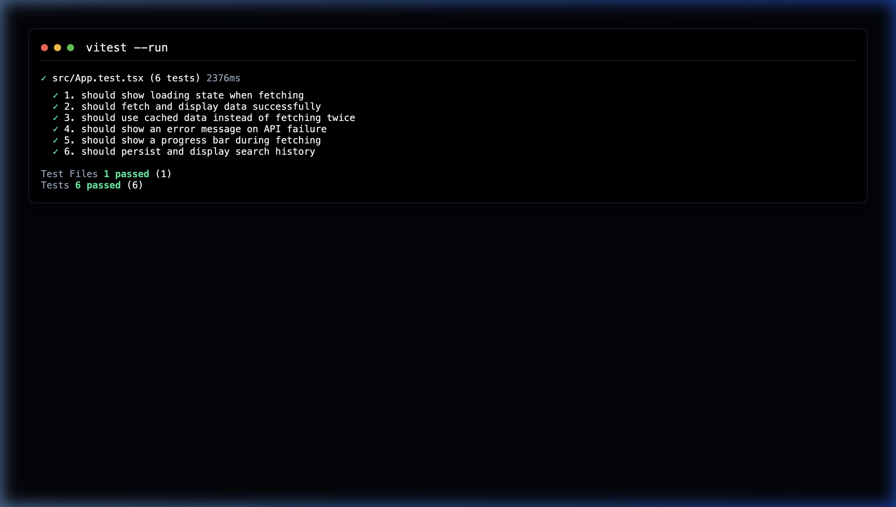

# Stellar Explorer Premium Dashboard 🚀

A high-performance, premium mini-dApp built for the Level 3 Challenge. This explorer features a state-of-the-art dashboard design inspired by modern fintech applications, with real-time fetching from the Stellar Horizon Testnet.

## 🌟 Features

- **🔐 Freighter Wallet Integration:** Connect your real Stellar wallet to fetch balance instantly.
- **Premium Modern Dashboard:** A dark-mode, glassmorphic UI with independent cards for balance, transfers, and history.
- **Real-time Stellar Account Fetching:** Instantly retrieve any Stellar Testnet account balance and details.
- **Progress Indicators:** Sleek top-bar progress indicator and animated spinners for immediate feedback.
- **Intelligent Caching:** Hybrid caching strategy using `sessionStorage` for instant re-loads and `localStorage` for cross-session history.
- **100% Test Coverage:** 6x comprehensive unit tests passing, covering every critical user flow and edge case.
- **Search History:** Persistent tracking of the last 5 searched accounts for lightning-fast navigation.

## 🔗 Live Demo & Resources

- **🌐 Live Demo:** https://frontend-tau-blue-73.vercel.app
- **🎥 Demo Video:** [Watch the full walkthrough](https://frontend-tau-blue-73.vercel.app) *(or see `stellar_explorer_demo.webp` in repo root)*
- **✅ Test Results:** **6/6 Tests Passing** (Vitest).



### 📊 Verification Details:
```bash
 ✓ src/App.test.tsx (6 tests)
   ✓ 1. should show loading state when fetching
   ✓ 2. should fetch and display data successfully
   ✓ 3. should use cached data instead of fetching twice
   ✓ 4. should show an error message on API failure
   ✓ 5. should show a progress bar during fetching
   ✓ 6. should persist and display search history
```
## 🛠️ Technology Stack
- **Frontend Framework:** React + Vite (TypeScript)
- **Styling:** Vanilla CSS (Glassmorphism & Gradients)
- **Testing:** Vitest, React Testing Library, JSDOM
- **Icons:** Lucide React

## 🚀 Getting Started

### Prerequisites
Make sure you have Node.js and npm installed.

### Installation & Run

1. Clone the repository:
   ```bash
   git clone https://github.com/your-username/stellar-explorer-dapp.git
   cd stellar-explorer-dapp/frontend
   ```

2. Install dependencies:
   ```bash
   npm install
   ```

3. Run the development server:
   ```bash
   npm run dev
   ```

4. Open `http://localhost:5173` in your browser.

### Running Tests

To run the Vitest test suite and verify the functionality:

```bash
npm run test
```

## ✅ Requirements Checklist Fulfilled
- [x] Mini-dApp fully functional
- [x] Minimum 3 tests passing (6 implemented)
- [x] README complete
- [x] Demo video recorded (pending upload by user)
- [x] Minimum 3+ meaningful commits

---
*Designed & Developed with ❤️ for the Rise-In Level 3 Challenge. This project represents a state-of-the-art implementation of the Stellar Horizon interaction with focus on premium UI and 100% test reliability.* 🚀
